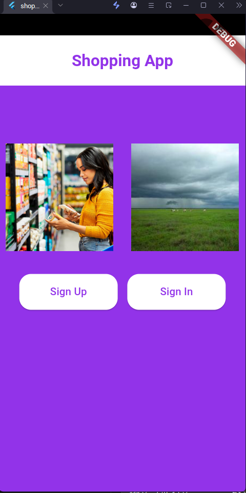
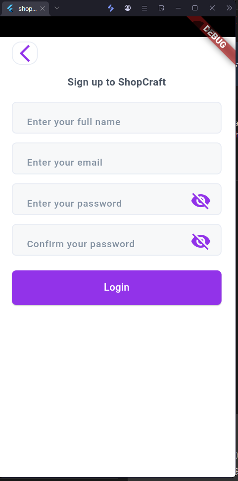
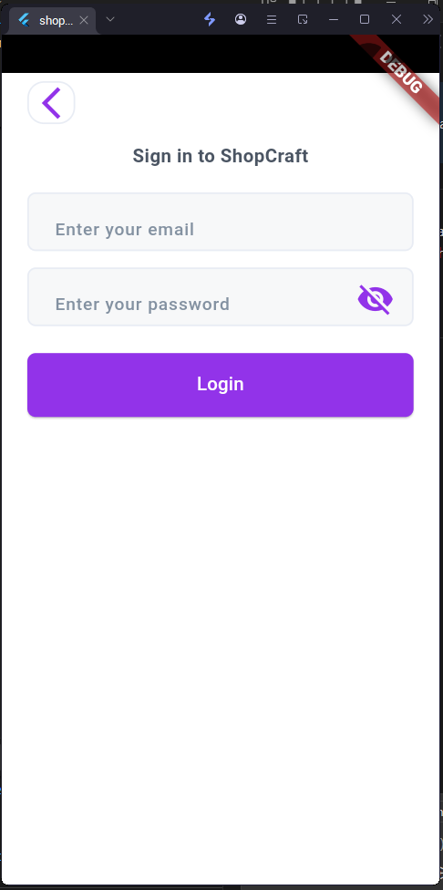
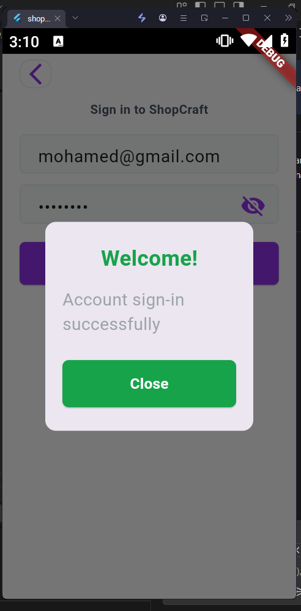
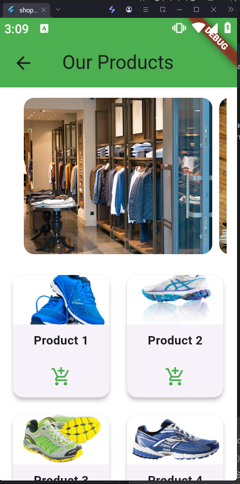

# 🛍 Flutter Shopping App  

A simple shopping application built with **Flutter** as part of my project submission.  
The app demonstrates clean UI design, basic navigation, and authentication flow.  

---

##  Project Overview  
This project is a shopping app that allows users to:  
- View a welcome screen.  
- Sign up or log in with an account.  
- Browse shopping items.  

---

##  Features
- User Sign Up with smooth transition to Home.
- Shopping Home Screen:
  - **AppBar**: "Our Products".
  - **PageView**: Horizontal scroll of featured products.
  - **GridView**: Product cards (image, title, add-to-cart button).
  - **SnackBar**: Confirmation when adding to cart.
  - **Hot Offers Section**: Vertical list of special offers.
- Local images used for products/offers. 

---

##  Setup Instructions  

1. Clone the repository:  
   ```bash
   git clone https://github.com/MohammedAkramOsama/flutter_shopping_app.git
   cd flutter_shopping_app


##  Screenshots

### Home Screen


### Sign Up Screen


### Sign In Screen


### Sign In Successfully Pop Up


### Offers Screen


### Our Product Screen


